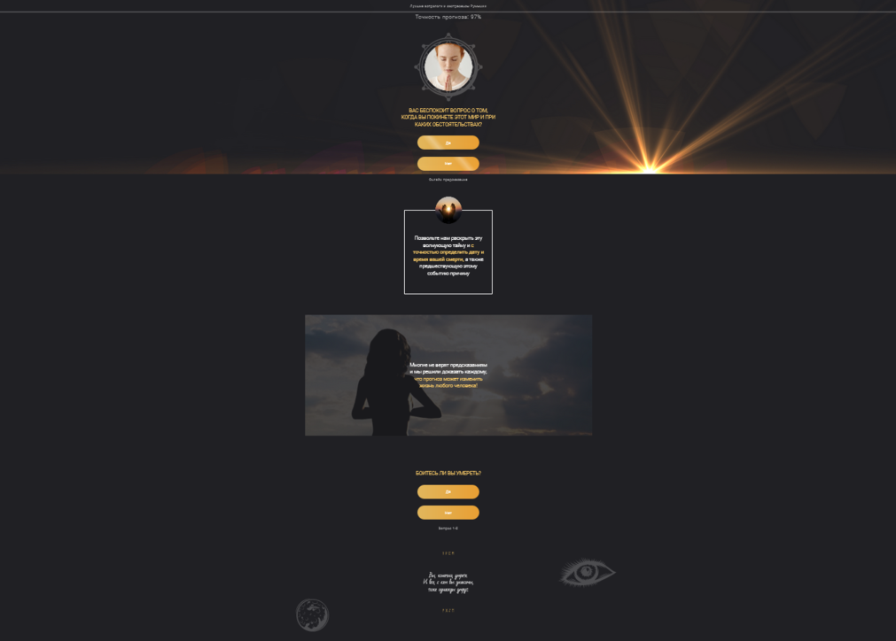

# Тестовое задание от компании ABC Mobile

Сверстать страницу по макету.

**Условия:**
- использовать нативный JS;
- не использовать pug;
- не использовать CSS-фреймворки;
- текст в футере показывается на две строки с возможностью увидеть остальное;
- лендинг должен нормально выглядеть на любых разрешениях.

После нажатия на кнопку звонка отправить запрос на:
https://swapi.dev/api/people/1/

Вывести полученные данные как угодно. Реализация любая (хоть в консоль).